# Mermaid 图表语法参考

- **版本**：1.0
- **适用范围**：流程图、思维导图、序列图、甘特图等 Mermaid 支持的所有图表类型
- **目标**：提供 Mermaid 各类图表的语法速查与完整示例

---

## 📚 目录

- [1. 思维导图](#1-思维导图)
- [2. 流程图](#2-流程图)
- [3. 序列图](#3-序列图)
- [4. 甘特图](#4-甘特图)
- [5. 类图](#5-类图)
- [6. 状态图](#6-状态图)
- [7. 饼图](#7-饼图)
- [8. ER 图](#8-er-图)
- [9. 用户旅程图](#9-用户旅程图)
- [10. 通用提示](#10-通用提示)

---

## 1. 思维导图

### 1.1 基本结构

使用 `mindmap` 关键字定义思维导图，通过**缩进**表示层级关系：

````markdown
```mermaid
mindmap
  root(（分数）)
    意义与定义
      把单位“1”平均分成若干份
      表示这样的一份或几份
    各部分名称
      分数线
      分母（总份数）
      分子（取的份数）
    分类
      真分数（分子 < 分母，值 < 1）
      假分数（分子 ≥ 分母，值 ≥ 1）
      带分数（整数 + 真分数）
    基本性质
      分子分母同时乘或除以相同的数（0除外）
      分数大小不变
    约分与通分
      约分：化成最简分数
      通分：化成分母相同的分数
    运算
      加减法
        同分母：分母不变，分子相加减
        异分母：先通分，再计算
      乘法
        分子乘分子，分母乘分母
      除法
        除以一个数等于乘它的倒数
    分数与小数
      分数化小数：分子 ÷ 分母
      小数化分数：根据位数写成分母10、100...
````

### 1.2 节点形状

| 语法       | 形状     | 示例               |
|------------|----------|--------------------|
| `((文本))` | 圆形     | `root((中心主题))` |
| `(文本)`   | 圆角矩形 | `主题(说明文字)`   |
| `[文本]`   | 方形     | `节点[详细描述]`   |
| 无括号     | 默认矩形 | `简单节点`         |

### 1.3 完整示例

````markdown
```mermaid
mindmap
  root((学习计划))
    数学
      代数
      几何
        平面几何
        立体几何
    语文
      阅读
      写作
    英语
      听力
      口语
      阅读
```
````

---

## 2. 流程图

### 2.1 基本语法

使用 `graph` 或 `flowchart` 关键字定义流程图：

````markdown
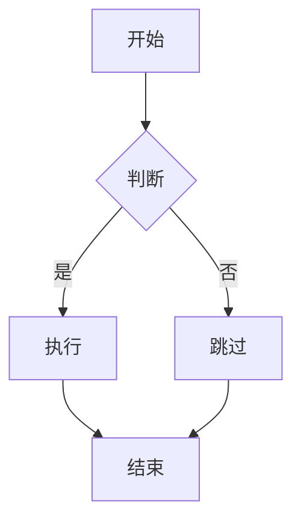
````

### 2.2 流程图方向

| 关键字      | 方向     | 说明                     |
|-------------|----------|--------------------------|
| `TB` / `TD` | 从上到下 | Top to Bottom / Top Down |
| `BT`        | 从下到上 | Bottom to Top            |
| `LR`        | 从左到右 | Left to Right            |
| `RL`        | 从右到左 | Right to Left            |

**示例（从左到右）：**

````markdown
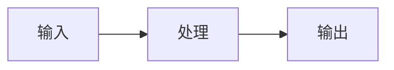
````

### 2.3 节点形状

| 语法         | 形状             | 示例          |
|--------------|------------------|---------------|
| `id[文本]`   | 方形（矩形）     | `A[开始]`     |
| `id(文本)`   | 圆角矩形         | `A(开始)`     |
| `id((文本))` | 圆形             | `A((开始))`   |
| `id{文本}`   | 菱形（判断）     | `A{条件?}`    |
| `id[[文本]]` | 子流程           | `A[[子流程]]` |
| `id[(文本)]` | 圆柱体（数据库） | `A[(数据库)]` |
| `id((文本))` | 圆形             | `A((状态))`   |
| `id>文本]`   | 旗帜形           | `A>备注]`     |

**示例：**

````markdown
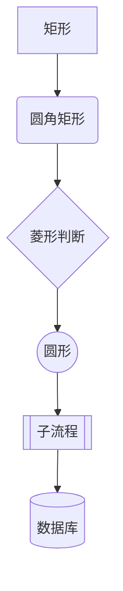
````

### 2.4 连线样式

| 语法              | 样式                     | 说明         |
|-------------------|--------------------------|--------------|
| `A --> B`         | 实线箭头                 | 最常用       |
| `A --- B`         | 实线无箭头               | 关联关系     |
| `A -.-> B`        | 虚线箭头                 | 可选/弱依赖  |
| `A ==> B`         | 粗线箭头                 | 强调         |
| `A --文字--> B`   | 带标注箭头               | 说明连线含义 |
| `A -->\|文字\| B` | 带标注箭头（另一种写法） | 同上         |
| `A --文字--- B`   | 带标注无箭头             | 说明关联     |
| `A -.文字.-> B`   | 带标注虚线               | 可选路径     |

**示例：**

````markdown
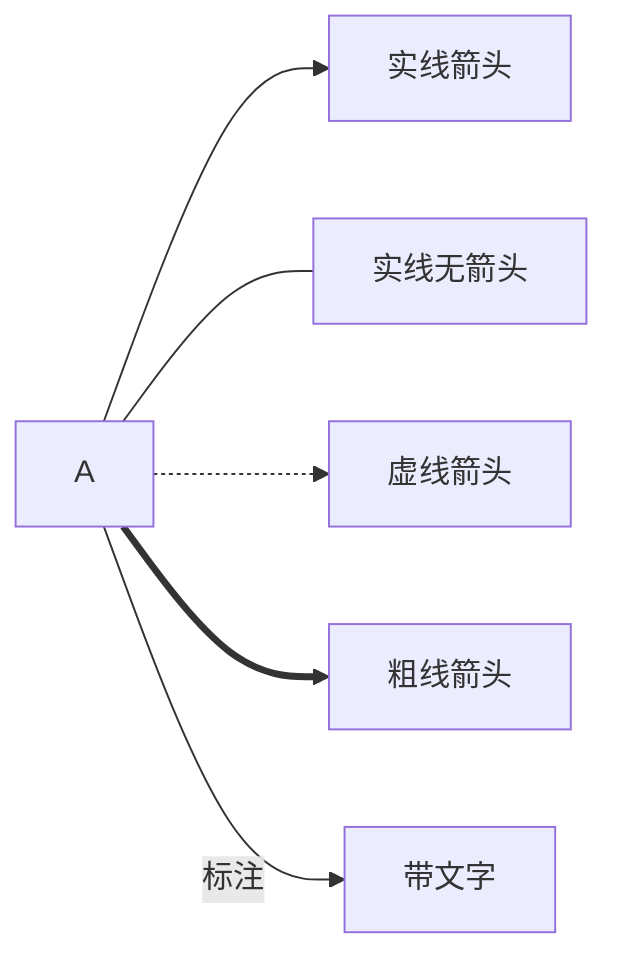
````

### 2.5 子图（Subgraph）

使用 `subgraph` 将节点分组：

````markdown
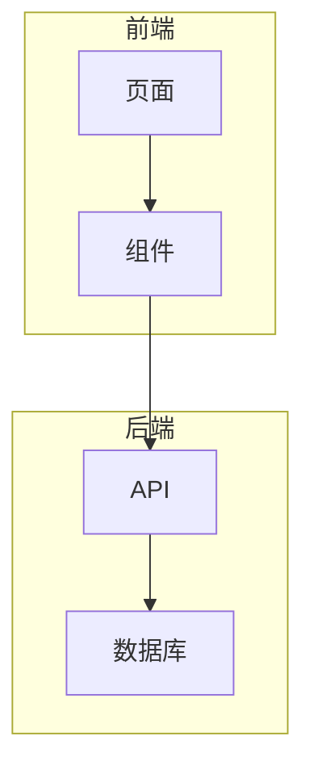
````

### 2.6 flowchart 与 graph 的区别

`flowchart` 是 `graph` 的增强版，支持更灵活的连线方式：

````markdown
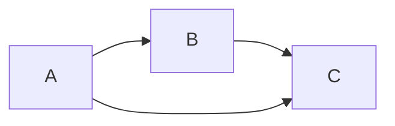
````

> `flowchart` 支持链式写法 `A --> B --> C`，而 `graph` 中需要逐行书写。

---

## 3. 序列图

### 3.1 基本语法

使用 `sequenceDiagram` 定义序列图，描述对象之间的交互时序：

````markdown
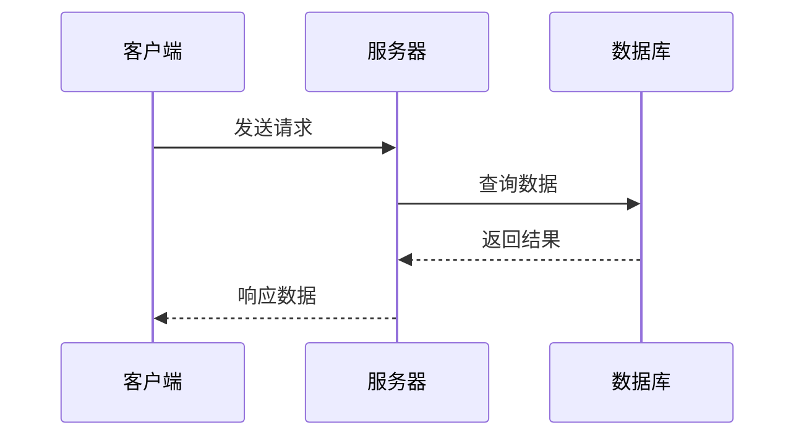
````

### 3.2 消息类型

| 语法   | 样式       | 说明               |
|--------|------------|--------------------|
| `->`   | 实线无箭头 | 同步消息           |
| `->>`  | 实线箭头   | 异步消息           |
| `-->>` | 虚线箭头   | 返回消息           |
| `--)`  | 开放箭头   | 异步消息（无箭头） |
| `-x`   | 叉号       | 请求失败           |

**示例：**

````markdown
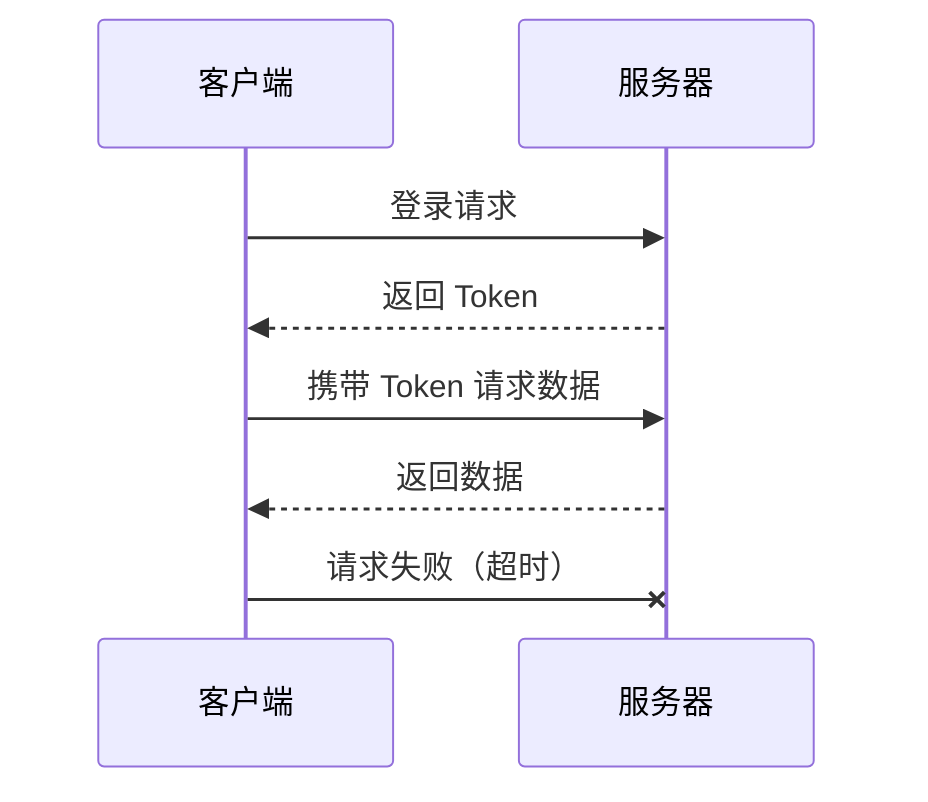
````

### 3.3 激活与停用

使用 `activate` / `deactivate` 显示对象活跃状态：

````markdown
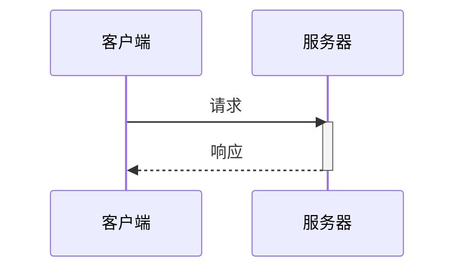
````

简写：`+` 表示激活，`-` 表示停用：

````markdown
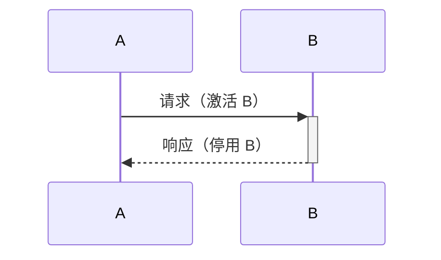
````

### 3.4 注释与循环

````markdown
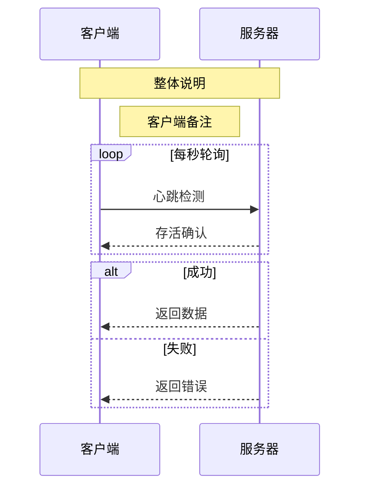
````

### 3.5 可选与并行

````markdown
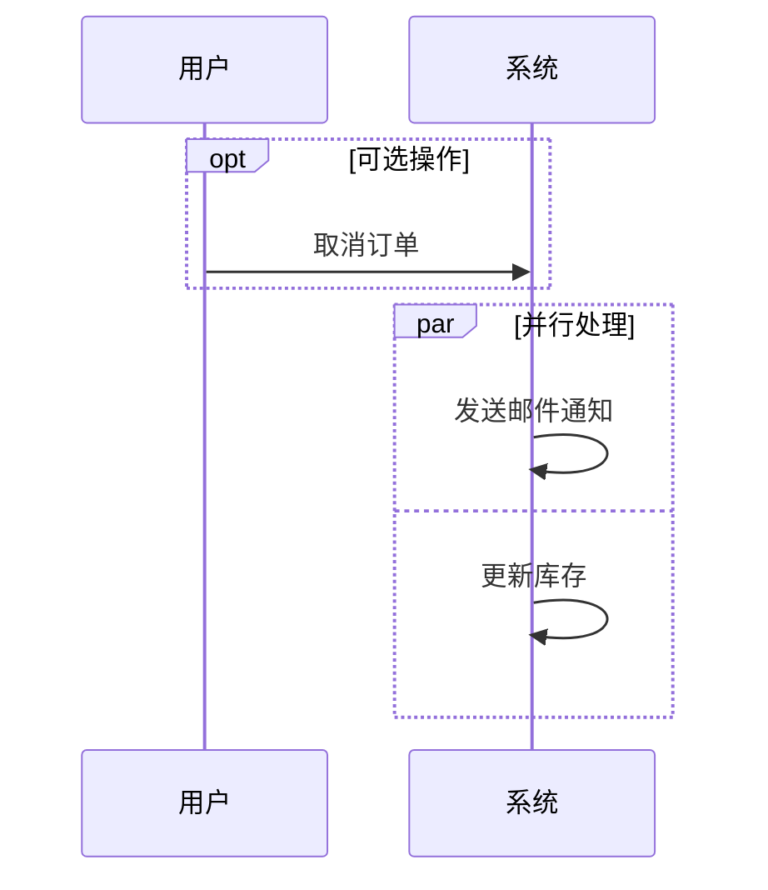
````

---

## 4. 甘特图

### 4.1 基本语法

使用 `gantt` 关键字定义甘特图，用于项目进度管理：

````markdown
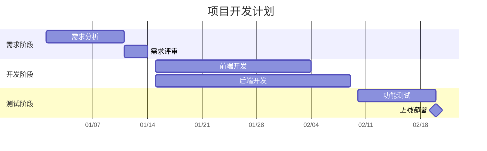
````

### 4.2 任务状态

| 语法                | 状态           | 说明       |
|---------------------|----------------|------------|
| `任务名`            | 默认（未开始） | 普通任务条 |
| `任务名 :active`    | 进行中         | 高亮显示   |
| `任务名 :done`      | 已完成         | 灰色/淡化  |
| `任务名 :crit`      | 关键任务       | 红色高亮   |
| `任务名 :milestone` | 里程碑         | 菱形标记   |

**示例：**

````markdown
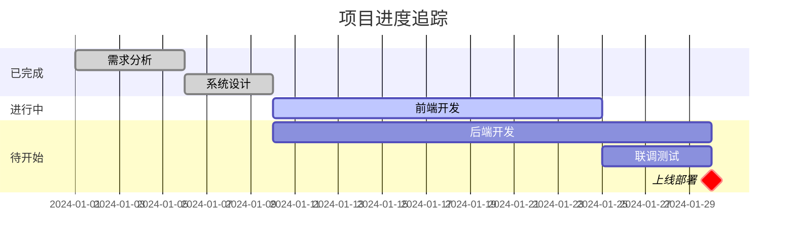
````

### 4.3 任务依赖

````markdown
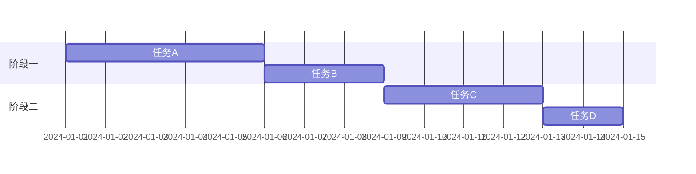
````

---

## 5. 类图

### 5.1 基本语法

使用 `classDiagram` 定义类图，用于面向对象设计：

````markdown
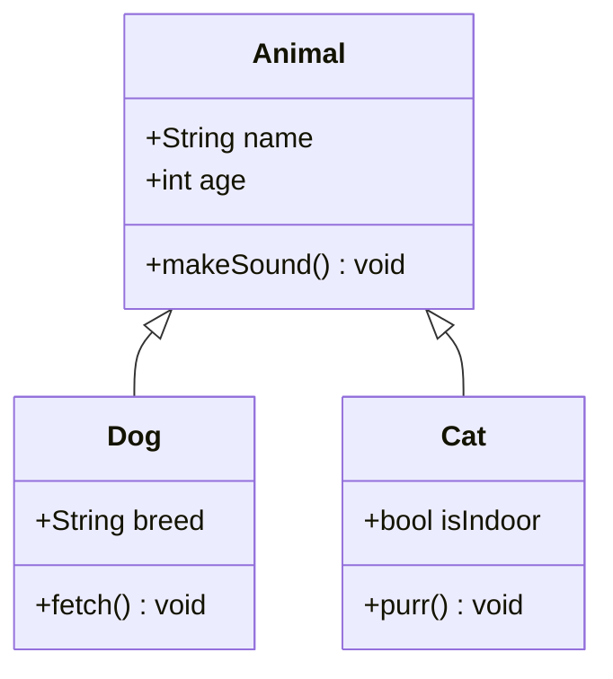
````

### 5.2 可见性标记

| 符号 | 可见性           | 说明     |
|------|------------------|----------|
| `+`  | Public           | 公开     |
| `-`  | Private          | 私有     |
| `#`  | Protected        | 受保护   |
| `~`  | Package/Internal | 包内可见 |

### 5.3 类之间的关系

| 语法  | 关系 | 说明       |
|-------|------|------------|
| `<    | --`  | 继承       | 子类继承父类 |
| `*--` | 组合 | 强拥有关系 |
| `o--` | 聚合 | 弱拥有关系 |
| `-->` | 关联 | 一般关联   |
| `--`  | 链接 | 实线连接   |
| `..>` | 依赖 | 虚线箭头   |
| `..   | >`   | 实现       | 接口实现     |
| `..`  | 虚线 | 弱关系     |

**完整示例：**

````markdown
```mermaid
classDiagram
    class Vehicle {
        <<abstract>>
        +String brand
        +start() void
        +stop() void
    }
    class Car {
        +int doors
        +drive() void
    }
    class Engine {
        +int horsepower
        +ignite() void
    }
    interface IMovable {
        +move() void
    }

    Vehicle <|-- Car : 继承
    Vehicle *-- Engine : 组合
    IMovable <|.. Car : 实现
    Car --> Engine : 关联
```
````

---

## 6. 状态图

### 6.1 基本语法

使用 `stateDiagram-v2` 定义状态图，描述对象状态变迁：

````markdown
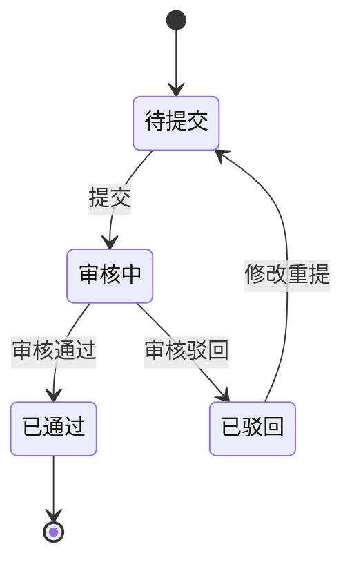
````

### 6.2 复合状态

````markdown
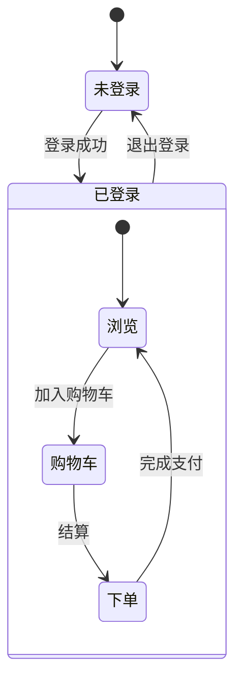
````

### 6.3 并行状态

使用 `--` 分隔并行区域：

````markdown
```mermaid
stateDiagram-v2
    [*] --> 运行中

    state 运行中 {
        [*] --> 加载中
        加载中 --> 就绪

        state 并行区域 {
            [*] --> 前台任务
            [*] --> 后台任务
        }
    }
```
````

---

## 7. 饼图

使用 `pie` 关键字定义饼图，展示数据占比：

````markdown
```mermaid
pie title 技术栈使用占比
    "JavaScript" : 40
    "Python" : 25
    "Go" : 15
    "Java" : 12
    "其他" : 8
```
````

带数据显示：

````markdown
```mermaid
pie showData
    title 项目时间分配
    "开发" : 45
    "测试" : 20
    "会议" : 15
    "文档" : 12
    "其他" : 8
```
````

---

## 8. ER 图

使用 `erDiagram` 定义实体关系图，用于数据库设计：

````markdown
```mermaid
erDiagram
    CUSTOMER ||--o{ ORDER : "下单"
    ORDER ||--|{ ORDER_ITEM : "包含"
    PRODUCT ||--o{ ORDER_ITEM : "被购买"

    CUSTOMER {
        int id PK
        string name
        string email
    }
    ORDER {
        int id PK
        int customer_id FK
        datetime created_at
        string status
    }
    ORDER_ITEM {
        int id PK
        int order_id FK
        int product_id FK
        int quantity
    }
    PRODUCT {
        int id PK
        string name
        float price
    }
```
````

### 关系符号

| 语法         | 关系   | 说明 |
|--------------|--------|------|
| `\|\|--\|\|` | 一对一 | 必须 |
| `\|\|--o{`   | 一对多 | 可选 |
| `\|\|--\|{`  | 一对多 | 必须 |
| `}o--o{`     | 多对多 | 可选 |

### 属性标记

| 符号 | 含义   |
|------|--------|
| `PK` | 主键   |
| `FK` | 外键   |
| `UK` | 唯一键 |

---

## 9. 用户旅程图

使用 `journey` 关键字定义用户旅程图，描述用户体验流程：

````markdown
```mermaid
journey
    title 用户购物体验
    section 浏览商品
      打开首页: 5: 用户
      搜索商品: 4: 用户
      查看详情: 4: 用户
    section 下单支付
      加入购物车: 5: 用户
      填写地址: 3: 用户
      完成支付: 3: 用户, 系统
    section 收货评价
      等待发货: 2: 用户, 系统
      确认收货: 5: 用户
      评价商品: 4: 用户
```
````

格式说明：
- 每行格式：`任务名: 满意度(1-5): 参与者`
- 满意度 1（低）到 5（高），用颜色深浅表示
- 多个参与者用逗号分隔

---

## 10. 通用提示

### 10.1 基本规则

- 使用 ` ```mermaid ` 代码块即可渲染图表
- 缩进使用**空格**，不要使用 Tab
- 节点文本中避免使用特殊字符 `{}[]<>`，如需使用请用引号包裹
- 节点 ID 不要包含空格，显示文本可使用任意字符

### 10.2 特殊字符处理

当节点文本包含特殊字符时，用双引号包裹：

````markdown
```mermaid
graph TD
    A["包含特殊字符 (括号)"] --> B["包含 <尖括号>"]
```
````

### 10.3 样式自定义

使用 `style` 关键字自定义节点样式：

````markdown
```mermaid
graph TD
    A[开始] --> B[处理]
    B --> C[结束]

    style A fill:#e1f5fe,stroke:#0288d1
    style B fill:#fff3e0,stroke:#f57c00
    style C fill:#e8f5e9,stroke:#388e3c
```
````

### 10.4 注释

在 Mermaid 中使用 `%%` 添加注释：

````markdown
```mermaid
graph TD
    %% 这是注释，不会渲染
    A --> B
```
````

### 10.5 各图表类型速查

| 关键字                | 图表类型   | 典型场景           |
|-----------------------|------------|--------------------|
| `mindmap`             | 思维导图   | 知识梳理、头脑风暴 |
| `graph` / `flowchart` | 流程图     | 业务流程、算法逻辑 |
| `sequenceDiagram`     | 序列图     | 系统交互、API 调用 |
| `gantt`               | 甘特图     | 项目排期、进度追踪 |
| `classDiagram`        | 类图       | 面向对象设计       |
| `stateDiagram-v2`     | 状态图     | 状态机、订单流转   |
| `pie`                 | 饼图       | 数据占比           |
| `erDiagram`           | ER 图      | 数据库设计         |
| `journey`             | 用户旅程图 | 用户体验、服务设计 |

---

> **文档结束** | Mermaid 官方文档：<https://mermaid.js.org>
